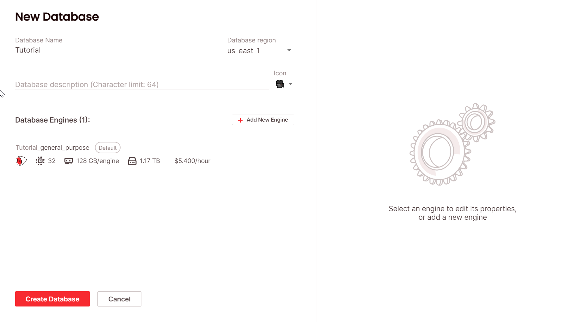
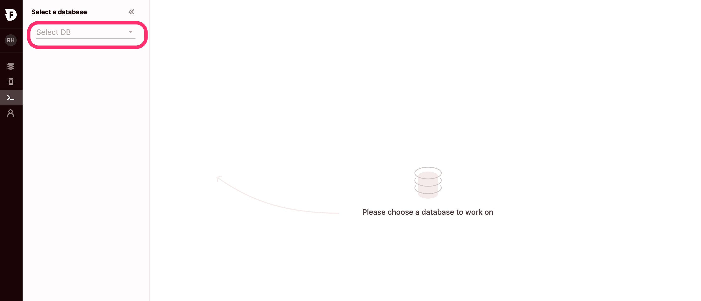
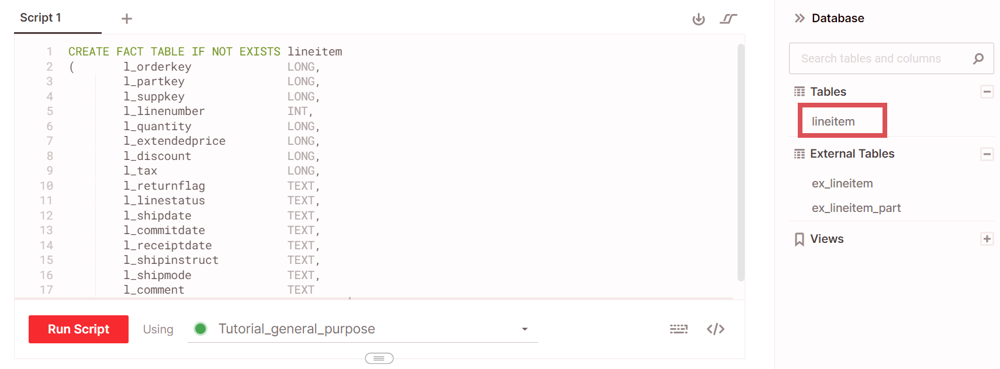
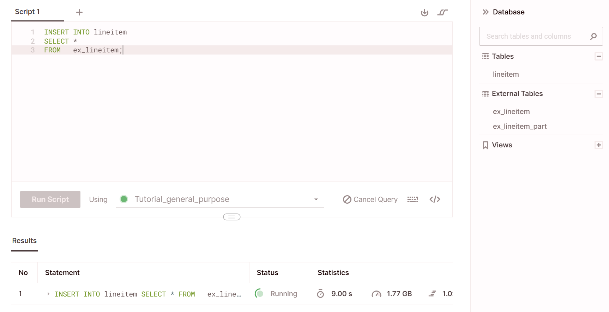
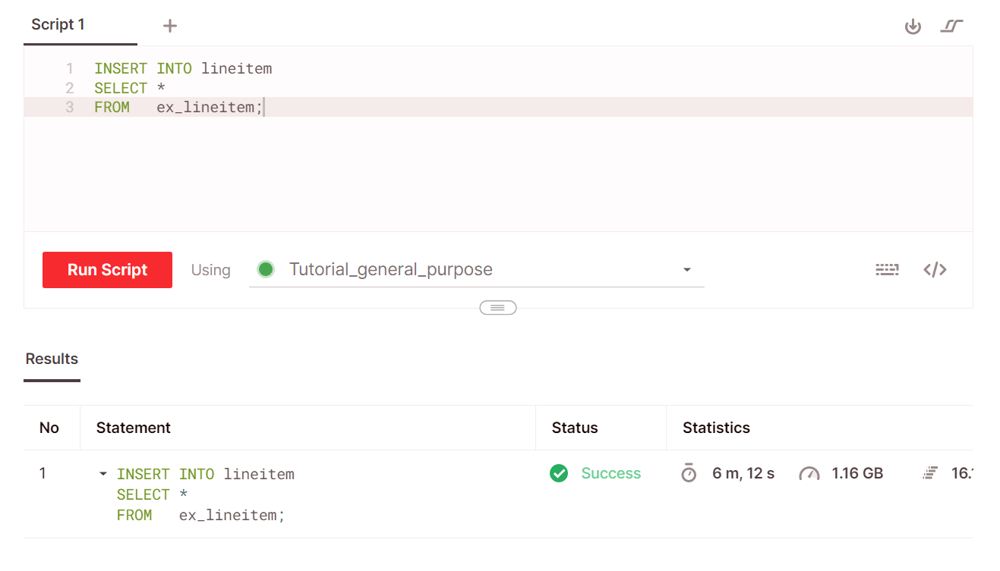

# Getting started tutorial

In this tutorial, you:

1. [Create your first database](./#create-your-first-database)
2. [Import data to Firebolt](./#import-data-into-firebolt)
3. [Configure an aggregating index](./#configure-an-aggregating-index)


In order to perform this tutorial, you need to have an active Firebolt account. Contact us via `hello@firebolt.io` in order to create one and see Firebolt in action.

## Create your first database

To start working with your data, you will need to create a new database and engine.


**Note**

A *Firebolt engine* represents the compute resources that are attached to a database for a certain workload. You can choose different engine types based on the workflow you plan on managing. Engines can be scaled up and down even after you’ve set up the initial configuration.


### Step 1: Create a new database and engine

From the **Databases** page, click **+ New DataBase**. Name your database _**Tutorial**_. Select `us-east-1` as the Database region.



Firebolt provides you by default with a general purpose engine optimized for data ingestion and analytic queries. You can edit the specifications of this engine. For this tutorial, we keep the provided engine as it is.

Click on **Create Database** to create both the database and engine.

### Step 2: Start the engine

From the **Database** page, locate the _**Tutorial\_general\_purpose**_ engine next to your _**Tutorial**_ database, and click on **Start** to start the engine. Once your engine is ready, the status changes to **On**.

### Step 3: Query the database

Go to the **SQL Workspace** page. You will be asked to choose a database:



Choose the _**Tutorial**_ database from the list. The _**Tutorial\_general\_purpose**_ engine will be used to run the queries on your database. You can always see the engine being used to run your workload in the SQL workspace:


Click **Run Script** in order to run the following SQL command:

```sql
SHOW DATABASES;
```

Firebolt returns a list of databases.

## Import data into Firebolt

To work with Firebolt, you need to connect to your data sources and ingest that data.\
Follow these steps to ingest your data into Firebolt:

### Step 1: Create an external table

You will now connect to a public S3 bucket (data source) that contains your parquet files. As part of this tutorial, you will use the Firebolt demo bucket, which contains tables from the TPC-H benchmark.

First, you will create an _external_ table.

An external table is a virtual table that directly connects to an external data source from your data lake, such as an S3 bucket, without having to load the data into a Firebolt table. Connecting to an external source to view this table is the first building block in the data load (_ingestion_) process.

Once you connect to an external table from Firebolt and create _fact and dimension tables_, you can then copy the external table data to those fact and dimension tables within the database in order to work with the data.

To do this, copy and paste the following command to the script editor in the **SQL Workspace** page (make sure the _**Tutorial**_ database is selected and you run your workload on the _**Tutorial\_general\_purpose**_ engine):

```sql
CREATE EXTERNAL TABLE IF NOT EXISTS ex_lineitem
(       l_orderkey              LONG,
        l_partkey               LONG,
        l_suppkey               LONG,
        l_linenumber            INT,
        l_quantity              LONG,
        l_extendedprice         LONG,
        l_discount              LONG,
        l_tax                   LONG,
        l_returnflag            TEXT,
        l_linestatus            TEXT,
        l_shipdate              TEXT,
        l_commitdate            TEXT,
        l_receiptdate           TEXT,
        l_shipinstruct          TEXT,
        l_shipmode              TEXT,
        l_comment               TEXT
)
URL = 's3://firebolt-publishing-public/samples/tpc-h/parquet/lineitem/'
-- CREDENTIALS = ( AWS_KEY_ID = '******' AWS_SECRET_KEY = '******' )
OBJECT_PATTERN = '*.parquet'
TYPE = (PARQUET);
```

**Note**

The Firebolt demo S3 bucket is configured to be accessed publicly, so we do not need to use the`CREDENTIALS`parameter. When you are accessing private data, you will need to use the relevant credentials.


The external table `ex_lineitem` appears on the object panel of the database.


### Step 2: Import data into Firebolt

In this step, you will create a Firebolt fact table called `lineitem` and then load it with data (_data ingestion_) in order to work with the data from the `ex_lineitem` _external table_.


**Notice**

In Firebolt, data is stored in either fact or dimension tables. Therefore, to make imported data available for querying, one of these tables must first be created.


For the fact table, as part of the `CREATE` script, we will declare (`l_orderkey, l_linenumber`) as its _primary index_. This tells Firebolt that the data should be sorted and indexed according to the (`l_orderkey, l_linenumber`) combination of fields. This optimizes range queries with the `l_orderkey, l_linenumber columns`. Primary indexes are mandatory for fact tables. Read our [guide on tables](concepts/working-with-tables.md#primary-index) for more help on creating primary indexes.

To do this, run the following command:

```sql
CREATE FACT TABLE IF NOT EXISTS lineitem
(       l_orderkey              LONG,
        l_partkey               LONG,
        l_suppkey               LONG,
        l_linenumber            INT,
        l_quantity              LONG,
        l_extendedprice         LONG,
        l_discount              LONG,
        l_tax                   LONG,
        l_returnflag            TEXT,
        l_linestatus            TEXT,
        l_shipdate              TEXT,
        l_commitdate            TEXT,
        l_receiptdate           TEXT,
        l_shipinstruct          TEXT,
        l_shipmode              TEXT,
        l_comment               TEXT
) PRIMARY INDEX l_orderkey, l_linenumber;
```

When successful, the table appears in the object panel of the database, similar to the following:



You can now use the `INSERT INTO` command to copy the data from the external table into the fact table as follows:

```sql
INSERT INTO lineitem
SELECT *
FROM   ex_lineitem;
```

Following is how it should look when you run the query:



When the import is completed, the Status column changes to `success`, as follows:



Now, query the data in the `lineitem` table to verify that the fact table was created successfully:

```sql
SELECT * FROM lineitem LIMIT 1000;
```

Following is how it should look when you run the query:


## Configure an aggregating index

For this portion of the tutorial, you will create an _aggregating index_.

The aggregating index enables you to take a subset of a table's columns and configure aggregations on top of those columns. Many aggregations are supported from the simple sum, max, min to more complex ones such as count and count (distinct). The index is automatically updated and aggregating as new data streams into the table without having to scan the entire table every time since the index is stateful and consistent.

The index is configured per table so when the table is queried, Firebolt's query optimizer searches the table's indexes for the index (or indexes) which has the potential for providing the most optimized query response time. When using the index - Instead of calculating the aggregation on the entire table and scanning all the rows, the aggregation is already pre-calculated in the aggregating index. No need to scan the entire table to perform the calculation.


From the _lineitem_ fact table you created in the previous step, let's assume you typically run queries to look at the `SUM(l_quantity)`, `SUM(l_extendedprice)`, and `AVG(l_discount)`, grouped by different combinations of `l_suppkey` and `l_partkey`.

To help you speed up your queries on this database, you will create a relevant aggregating index.

1.  Copy the following script:

    ```sql
    CREATE AGGREGATING INDEX agg_lineitem ON lineitem
    (
      l_suppkey,
      l_partkey,
      SUM(l_quantity),
      SUM(l_extendedprice),
      AVG(l_discount)
    );
    ```
2. Paste it to the script editor in the **SQL Workspace** page (make sure the _**Tutorial**_ database is selected and you run your workload on the _**Tutorial\_general\_purpose**_ engine). When successful, a confirmation message appears below the editor.
3.  Now populate the index with values by running the GENERATE command. Use the following script:

    ```
    GENERATE AGGREGATING INDEX agg_lineitem;
    ```

    When successful, a confirmation message appears below the editor.

From now on, every query for data from the *lineitem* table that combines any of these fields and aggregations will now use the index you just created instead of the full table in order to run the query and retrieve a response. Read more about aggregating indexes [here](concepts/get-instant-query-response-time.md#get-sub-second-query-response-time-using-aggregating-indexes).

**Congratulations! You can now use Firebolt to run queries on the demo database!**
